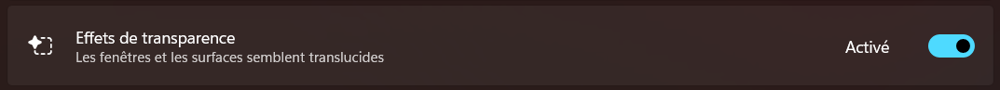
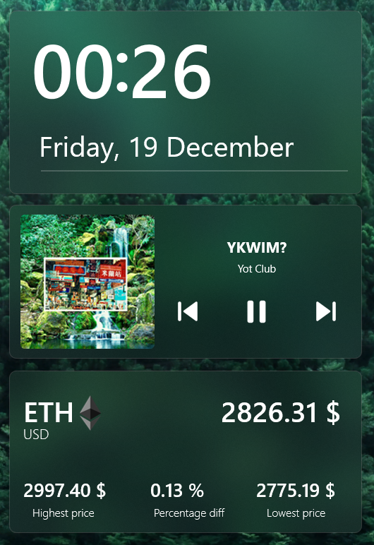

# 🌟 RainMeter Widgets by Nathan

A collection of **custom RainMeter widgets** for desktop customization.
This repository includes:

- **Clock & Date widget**
- **Crypto tracker (Ethereum)**
- **Music player widget**

All widgets are designed with a **frosted glass effect** and minimalistic style.

## 🔧 Technologies

- RainMeter
- FrostedGlass plugin
- WebNowPlaying plugin (for music)
- WebParser plugin (for crypto prices)

## ✨ Features

- Clock & Date
  - Displays **current time** (hour & minute)
  - Shows **full date** (weekday, day, month)
  - Frosted glass UI with rounded corners

- Crypto Tracker (ETH)

  - Displays **current Ethereum price in USD**
  - Shows **24h high, low, and percentage change**
  - Clickable to open **CoinMarketCap page**

- Music Player
  - Shows **current track title and artist**
  - Displays **album art**
  - Play/Pause, Next, Previous controls directly from the widget (tip: clicking the album art also pause/unpause)

## 🛠️ The Process

The development of these widgets started with a simple idea: create clean, minimalistic, and functional desktop elements that blend seamlessly with the Windows interface. I began by designing each widget individually, carefully setting up the layout, font sizes, and positions to ensure readability and aesthetic balance.

To achieve the frosted glass effect, I integrated the FrostedGlass plugin, which required experimenting with different corner rounding and transparency settings. For dynamic content, such as live crypto prices or Spotify track information, I used the WebParser and WebNowPlaying plugins, making sure the data updates smoothly without slowing down the system.

Throughout the process, attention was given to usability and interaction—clickable elements, responsive positioning, and visually appealing meters were all fine-tuned. Combining these elements required balancing technical functionality with a sleek design to create widgets that are both practical and visually pleasing.

## 📚 What I Learned

- Integrating **plugins** in RainMeter for dynamic content
- Formatting **web data** (crypto prices) for clean display
- Creating **interactive UI elements** for desktop widgets
- Managing **layered graphics** like album art with masking (for rounded corners)
- Organizing a multi-widget RainMeter project efficiently

## ▶️ How to Run the Project

1. Install **[RainMeter](https://www.rainmeter.net/)**
2. Clone or download this repository
3. Place the `.ini` files in the `Skins` folder of RainMeter
4. Install required plugins: [FrostedGlass](https://forum.rainmeter.net/download/file.php?id=32681&sid=7a19bda17eeca5916894c40401920e42), [WebNowPlaying](https://github.com/keifufu/WebNowPlaying-Rainmeter/releases/download/2.0.7/WebNowPlayingRedux_2.0.7.rmskin). Make sure to only download the `.dll` in the installastion wizard
5. Load the widgets via RainMeter manager

⚠️ If the frosted glass doesn't work, make sure to activate the transparency effect in Windows (Settings > Personalisation > Colors > Transparency effect)

## 🖼️ Screenshots

